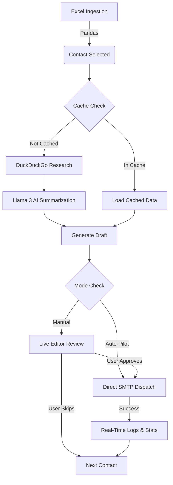
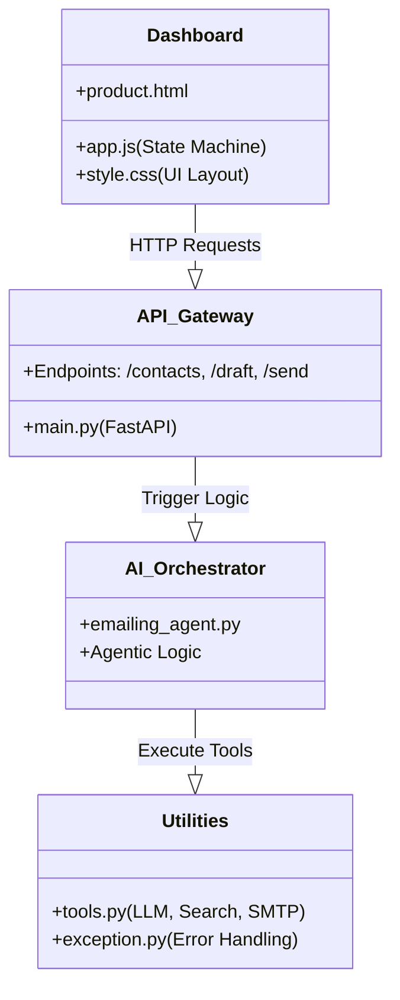

# 🚀 AgenticOutreach: Hyper-Personalized AI Outreach SaaS

**AgenticOutreach** is a state-of-the-art cold emailing platform that combines **Agentic AI** with a **Human-in-the-Loop** (HITL) workflow. Unlike traditional mass-mailers, this system researches every prospect individually, identifies real-time technical challenges, and drafts personalized value propositions before any email is sent.

---

## 🌊 System Workflow (Pictorial)



---

## 🏗️ Project Architecture



---

## 📂 Project Structure Explained

### 🏗️ Core Application
-   **`main.py`**: The central nervous system of the SaaS. It initializes the **FastAPI** app, manages the Jinja2 template engine, and exposes the interactive API endpoints.
-   **`requirements.txt`**: Lists all necessary dependencies, including `langgraph`, `fastapi`, `pandas`, and `langchain-groq`.
-   **`.env`**: Stores sensitive credentials (API keys, SMTP passwords).

### 🛠️ Backend Logic (`src/`)
-   **`src/tools.py`**: A library of core utilities:
    *   `get_llm()`: Configures the Llama-3-8B model with low temperature for deterministic drafting.
    *   `get_data()`: Robust Excel reader with automated `NaN` handling and type conversion.
    *   `research_company()`: Real-time search tool using DuckDuckGo.
    *   `send_final_email()`: Executes SMTP dispatch with multipart MIME support for attachments.
-   **`src/agents/emailing_agent.py`**: Orchestrates the AI's research results into a coherent, personalized draft using the `EMAIL_TEMPLATE`.
-   **`src/exception.py`**: Implements global error catching to provide user-friendly logs in the dashboard.

---

## 📊 Traditional vs. Agentic Outreach

| Feature | Traditional Tools | AgenticOutreach |
| :--- | :--- | :--- |
| **Personalization** | Template tags (e.g., `Hi {Name}`) | Real-time research & problem deduction |
| **Relevancy** | Static lists | Live news & AI initiative alignment |
| **Workflow** | Set and forget (Low response) | Human-in-the-Loop Review (High conversion) |
| **Attachments** | Often blocked as spam | Professional SMTP with resume support |
| **Intelligence** | None | Deduces technical engineering pain points |

---

## 🛠️ Setup & Installation

### 1. Clone & Environment
```bash
git clone https://github.com/your-username/Agentic_Outreach.git
cd Agentic_Outreach
python -m venv .venv
source .venv/bin/activate  # Windows: .venv\Scripts\activate
pip install -r requirements.txt
```

### 2. Configuration
Create a `.env` file with:
- `GROQ_API_KEY`: Get from [Groq Cloud](https://console.groq.com/).
- `GMAIL_ADDRESS`: Your sender email.
- `GMAIL_APP_PASSWORD`: Gmail > Security > App Passwords.

### 3. Execution
```bash
uvicorn main:app --reload
```

---

## ☁️ Deployment (Vercel)

This project is configured for easy deployment on **Vercel** via the `@vercel/python` runtime.

1.  **Install Vercel CLI:** `npm i -g vercel`
2.  **Login:** `vercel login`
3.  **Deploy:** `vercel`
4.  **Environment Variables:** Ensure you add the following in the Vercel Dashboard:
    - `GROQ_API_KEY`
    - `GMAIL_ADDRESS`
    - `GMAIL_APP_PASSWORD`
    - `SENDER_NAME`

> [!IMPORTANT]
> Vercel's free tier has a **10-second timeout** for serverless functions. Because AI drafting and research can take longer, you may need to upgrade to a Pro plan or deploy to a platform like **Render**, **Railway**, or **DigitalOcean App Platform** for longer-running tasks.

---

## 🛡️ Security & Performance
-   **Environment Safety:** All secrets are managed via `.env` and excluded from git via `.gitignore`.
-   **In-Memory Caching:** Prevents redundant search queries for multiple contacts at the same company, significantly reducing latency.
-   **Rate Limiting Handling:** The backend includes retry logic and structured error handling for LLM API calls.

---

## ❓ Troubleshooting

-   **`JSON Serialization Error (NaN)`**: Occurs if the Excel has empty cells. Fixed in `src/tools.py` via `.fillna('')`.
-   **`400 - Failed to call function`**: Occurs if the LLM struggles with tool-calling. Resolved by direct tool invocation in `emailing_agent.py`.
-   **`Address not found / Bounce`**: Ensure the email in the Excel sheet doesn't have leading/trailing spaces (auto-stripped by the latest code).

---

## 🗺️ Roadmap
- [ ] **Persistent Cache:** Migrate in-memory cache to SQLite or Redis.
- [ ] **Multi-Model Support:** Toggle between Llama 3, Claude 3.5, and GPT-4o.
- [ ] **Attachment Rotation:** Support for dynamically selecting different resume versions.
- [ ] **Analytics Dashboard:** Track open rates and response rates over time.

---

## 📜 License
MIT License. Created by [Dravin Kumar Sharma].